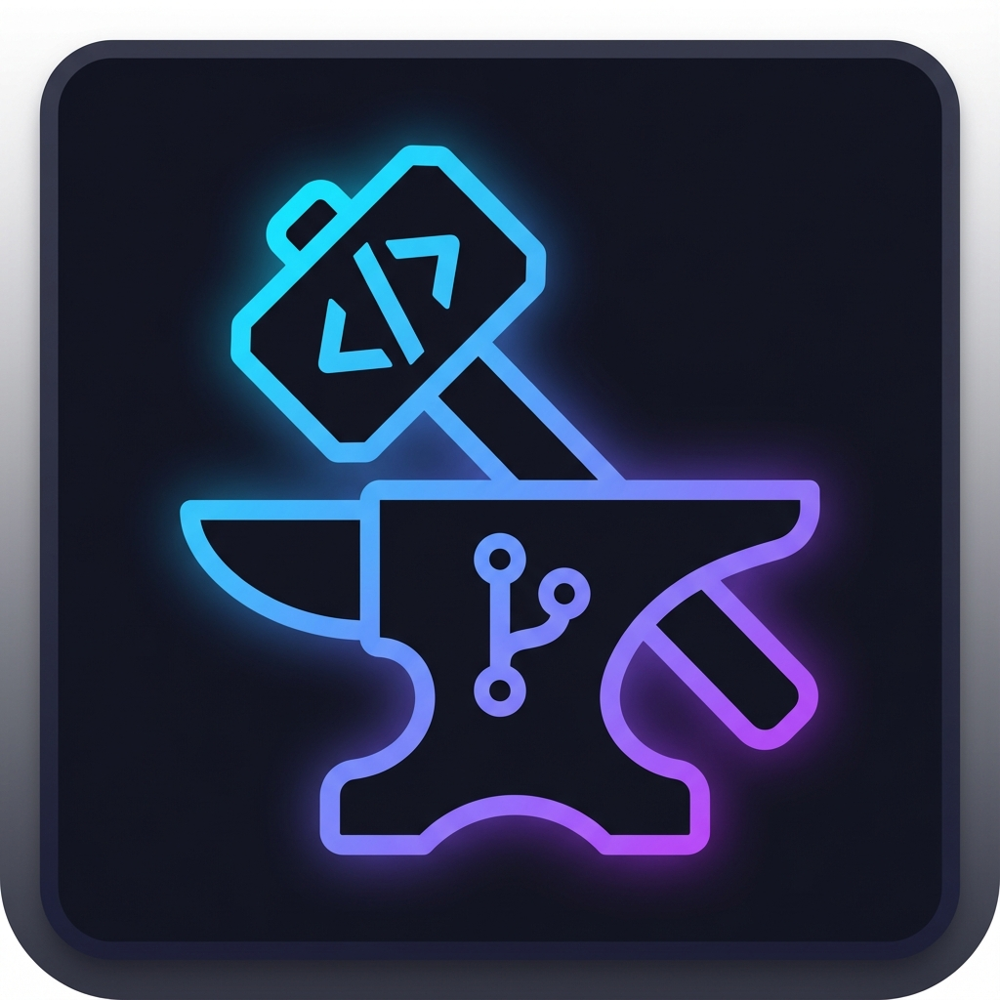

# Commit Craft



**Commit Craft** est une extension VS Code puissante conçue pour simplifier et professionnaliser la gestion de vos messages de commit. En s'appuyant sur l'IA, elle vous aide à rédiger des messages clairs, structurés et conformes aux meilleures pratiques de l'industrie (Conventional Commits).

## Fonctionnalités

- **Génération intelligente** : Utilisez l'IA (OpenAI) pour analyser vos changements et suggérer des messages de commit pertinents.
- **Support des Conventional Commits** : Structurez vos messages avec des types précis (feat, fix, chore, docs, etc.).
- **Interface intégrée** : Une vue latérale dédiée pour gérer vos commits sans quitter votre environnement de travail.
- **Actions Git rapides** : Stage, unstage et discard directement depuis l'interface de l'extension.
- **Raccourcis productifs** : Support de `Ctrl+Enter` pour valider vos commits rapidement.

## Installation

1. Installez l'extension via le Marketplace VS Code ou en téléchargeant le fichier `.vsix`.
2. Assurez-vous d'avoir une clé API OpenAI valide.

## Configuration

Une fois installée, configurez votre clé API OpenAI pour activer la génération automatique :

1. Ouvrez les **Paramètres** de VS Code (`Ctrl+,`).
2. Recherchez `Commit Craft`.
3. Entrez votre clé dans le champ `Commit Craft: OpenAI API Key`.

## Utilisation

1. Ouvrez la barre latérale **Commit Craft** depuis l'Activity Bar (icône du marteau et de l'enclume).
2. Sélectionnez les fichiers à inclure (Stage).
3. Cliquez sur l'icône Sparkle pour générer un message ou rédigez le vôtre.
4. Appuyez sur le bouton **Commit** ou utilisez `Ctrl+Enter`.

## Développement et Packaging

Si vous souhaitez contribuer ou générer votre build :

### Prérequis

- [pnpm](https://pnpm.io/) installé sur votre machine.

### Installation des dépendances

```bash
pnpm install
```

### Compilation

```bash
pnpm run compile
```

### Générer le fichier .vsix

```bash
pnpm run package
```

## Release Notes

### 0.0.1

- Version initiale de Commit Craft.
- Intégration de la génération de messages via OpenAI.
- Support de base des actions Git (Stage, Unstage, Commit).
- Interface Sidebar moderne et responsive.

---

**Enjoy Crafting your Commits!**
